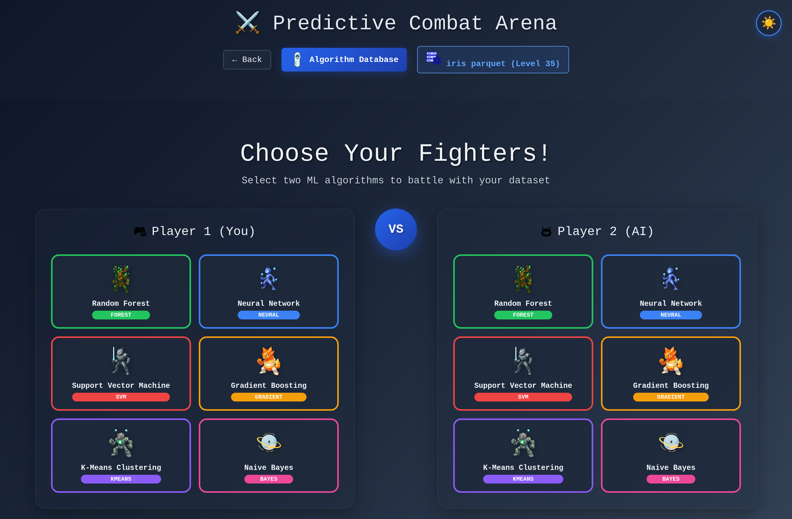
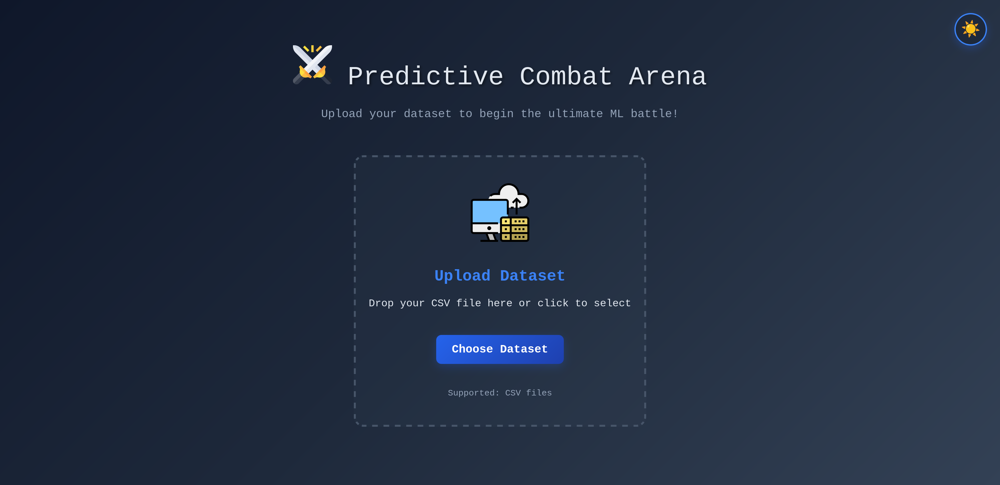
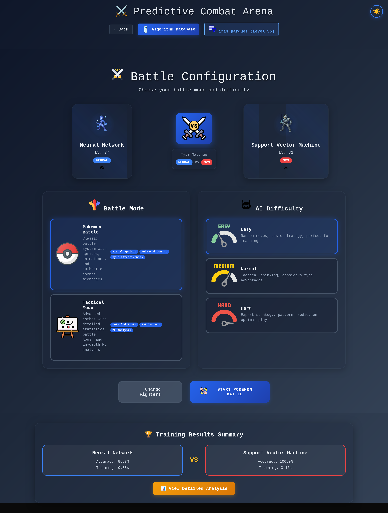
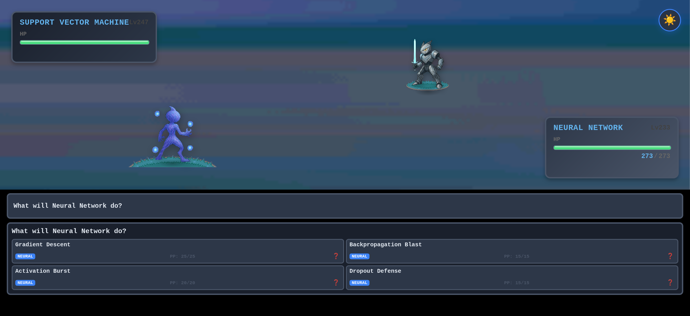

# 🥊 Predictive Combat Arena

**The world's first browser-based ML combat system where algorithms battle using real performance metrics.**


<div align="center">
  
  <p><em>Choose your ML fighters and watch them train on real data!</em></p>
</div>

---

## 🎯 What is it?

Upload your CSV dataset and watch machine learning algorithms battle Pokemon-style! Each algorithm trains **for real** using scikit-learn in your browser, then fights based on authentic performance metrics like accuracy, precision, and recall.

🌳 **Random Forest** vs 🧠 **Neural Network** - who wins on YOUR data?

<div align="center">
  
  <p><em>Drag & drop your CSV with Pokemon-style "Wild Dataset Appeared!" interface</em></p>
</div>

---

## ✨ Key Features

- 🔥 **Real ML Training** - Actual scikit-learn algorithms running in browser via Pyodide
- 📊 **Live Analytics** - Real-time training progress with interactive charts and dashboards
- 🎮 **Pokemon Battle System** - Nostalgic interface with sprites, animations, and type advantages
- 📈 **Performance Visualization** - Radar charts, rankings, and detailed metric comparisons
- 🧠 **Educational AI** - Gemini API provides dataset insights and learning explanations
- 📱 **Responsive Design** - Works perfectly on desktop and mobile

---

## 🚀 Quick Start

### Prerequisites
- Node.js 18+
- Modern browser with WebAssembly support

### Installation
```bash
# Clone the repository
git clone https://github.com/your-username/predictive-combat-arena.git
cd predictive-combat-arena

# Install dependencies
npm install

# Start development server
npm run dev
```

### Environment Setup
Create a `.env` file:
```env
VITE_GEMINI_API_KEY=your_gemini_api_key_here
```

---

## 🎮 How to Play

1. **📁 Upload Dataset** - Drag & drop your CSV file
2. **🔍 AI Analysis** - Get instant insights about your data
3. **⚔️ Choose Fighters** - Select two ML algorithms
4. **🏃‍♂️ Watch Training** - See real-time progress as algorithms train
5. **📊 View Analytics** - Explore performance charts and metrics
6. **⚡ Epic Battle** - Pokemon-style combat based on real ML performance!

<div align="center">
  
  <p><em>Configure your battle mode and AI difficulty before the epic showdown</em></p>
</div>

---

## 🏆 Epic Pokemon-Style Battles

Experience authentic Pokemon combat with real ML performance determining the outcome!

<div align="center">
  
  <p><em>Watch algorithms battle with sprites, animations, and authentic Pokemon mechanics</em></p>
</div>

---

## 🎯 Supported Algorithms

| Algorithm | Type | Specialty | Color |
|-----------|------|-----------|--------|
| 🌳 Random Forest | Forest | Ensemble Learning | Green |
| 🧠 Neural Network | Neural | Deep Learning | Blue |
| ⚔️ Support Vector Machine | SVM | Margin Optimization | Red |
| ⚡ Gradient Boosting | Gradient | Sequential Learning | Orange |
| 🎲 Naive Bayes | Bayes | Probabilistic | Pink |
| 🔮 K-Means | K-Means | Clustering | Purple |

---

## 🛠️ Tech Stack

- **Frontend:** SvelteKit + TypeScript
- **ML Engine:** Pyodide + scikit-learn
- **Visualizations:** D3.js + Custom CSS animations
- **AI Analysis:** Google Gemini API
- **Data Processing:** Papa Parse
- **Styling:** Tailwind CSS + Custom Pokemon-style CSS

---

## 📊 Performance Metrics

Combat stats are calculated from **real ML performance:**

- **Attack** = Precision × 100
- **Defense** = Recall × 100
- **Speed** = 100 - (Training Time × 10)
- **Health** = Accuracy × 100 + Base Robustness
- **Critical Hit Rate** = F1-Score

---

## 🎓 Educational Value

Learn ML concepts through gameplay:
- **Algorithm Comparison** - See real performance differences
- **Metric Understanding** - Visualize precision vs recall trade-offs
- **Dataset Analysis** - Understand what makes data challenging
- **Interactive Learning** - Hover tooltips explain ML concepts
- **Performance Visualization** - Charts show training progress

---

## 🏆 Awards & Recognition

Built for **Data Hackfest 2025** - 48 hours of intensive development combining education, entertainment, and technical innovation.

---

## 👥 Team

- **Rayane Rousseau** - Lead Developer 
- **Gourav Sharma** - Member
- **Rohan Fernandez** - Member

---

## 🤝 Contributing

We welcome contributions! Please see our [Contributing Guidelines](CONTRIBUTING.md) for details.

### Development Setup
```bash
# Install dependencies
npm install

# Run development server
npm run dev

# Build for production
npm run build

# Run tests
npm run test
```

---

## 🙏 Acknowledgments

- **Pokemon Company** - For the inspiration and nostalgic aesthetics
- **scikit-learn** - For making ML accessible and powerful
- **Pyodide** - For bringing Python ML to the browser
- **SvelteKit** - For the amazing developer experience
- **Google Gemini** - For intelligent dataset analysis

---

## 🔗 Links

- **Video Demo:** [YouTube Demo](https://youtube.com/your-demo-video) Will be added in a few hours

---

**Making machine learning accessible, one Pokemon battle at a time!** 🚀

*Built with ❤️ during Data Hackfest 2025*